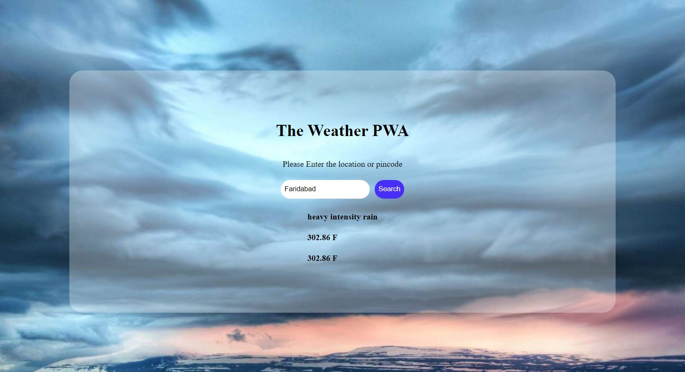

## Weather Pwa
It will show the weather depending on the city, state, or zipcode entered. It is a PWA which completes all the chrome lighthouse checks. Please deploy it to online server like github pages, webhost or any other to get the https test passed.

#### Preview : - 

#### Features : - 
1. Pass all the lighthouse test
2. Light weight with only jquery dependency.
3. Responsive and Great UI.

#### Api used
Open weather Api

##### Last Update
31 March 2021
